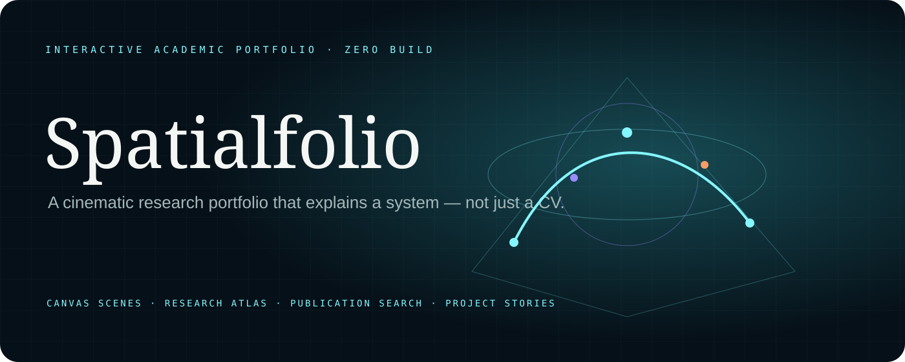
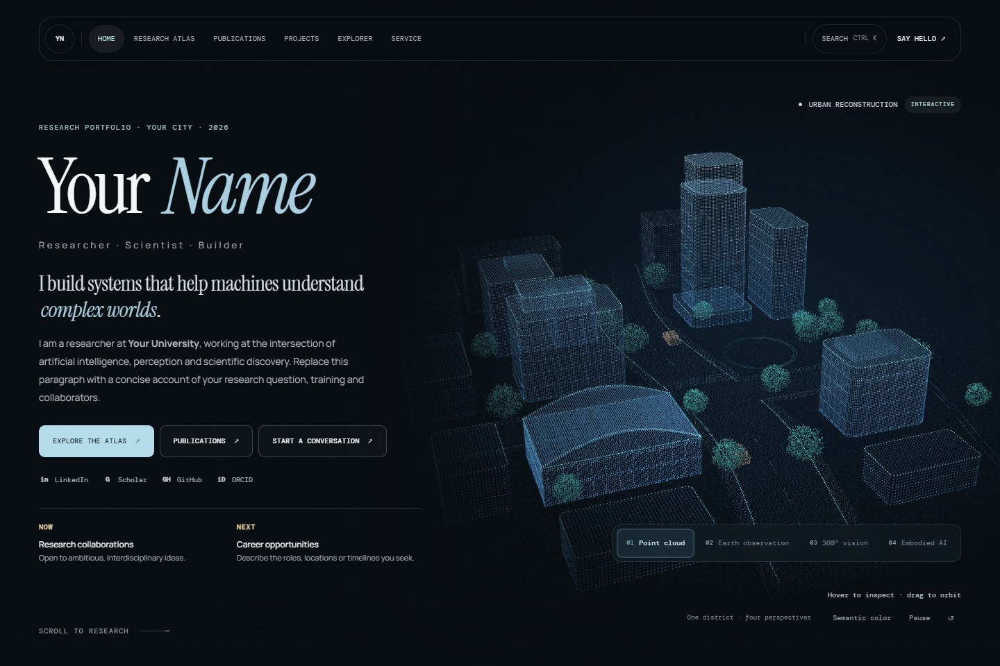
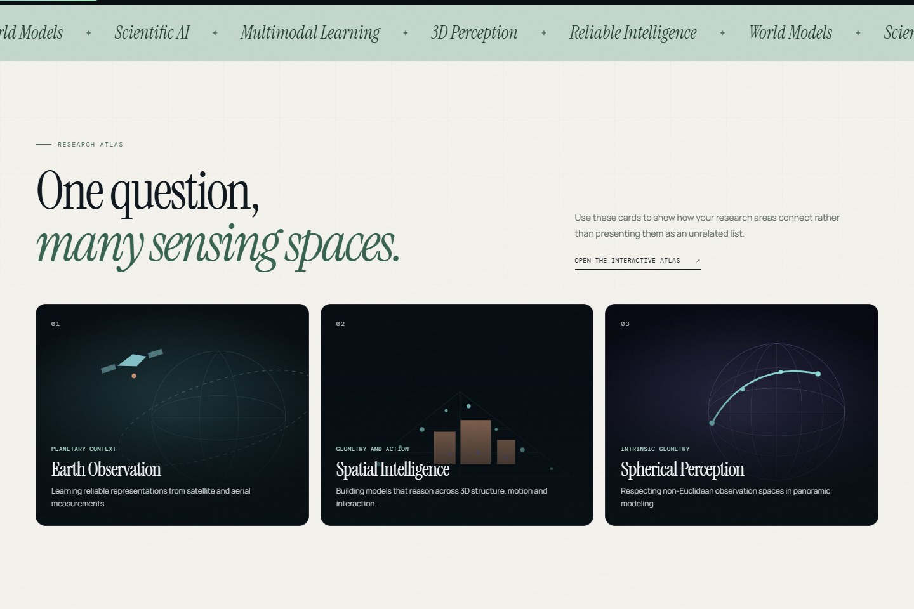
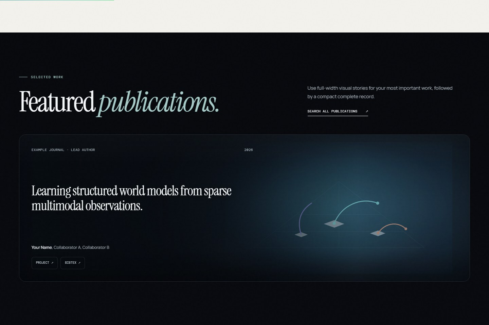
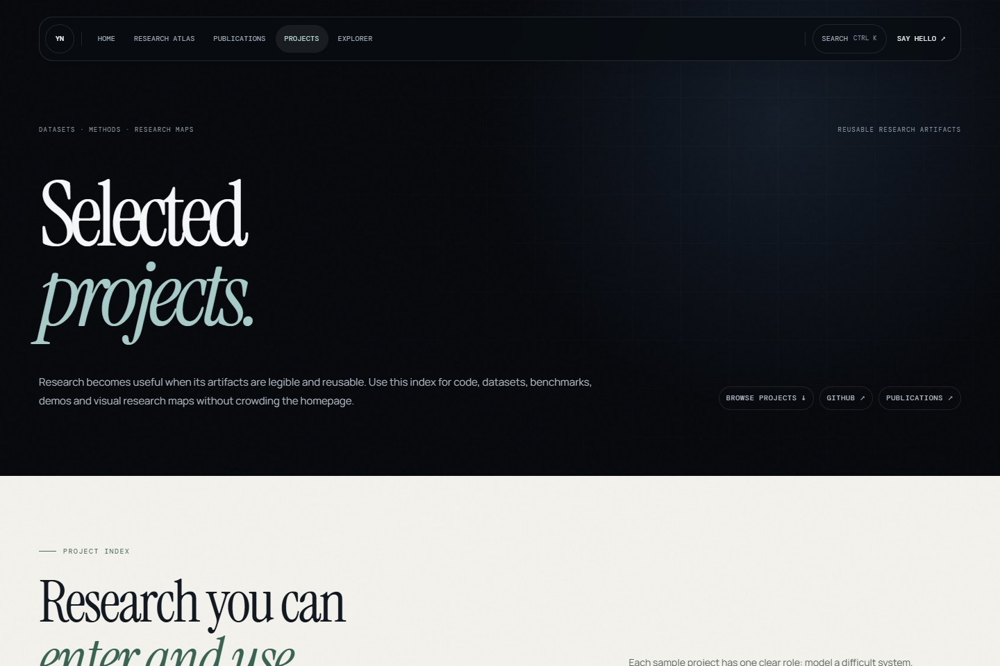
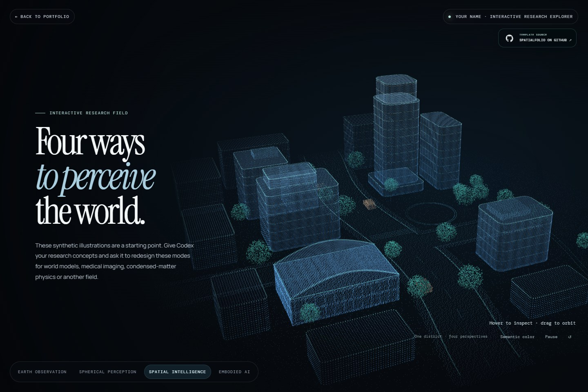

<p align="right"><a href="README.md">English</a></p>



# Spatialfolio——交互式学术主页模板

一款面向研究人员的沉浸式、交互式学术主页模板。它的目标不是把简历搬到网页上，而是用清晰的视觉层级解释你的**研究体系、代表成果与学术身份**。

<p align="center">
  <strong><a href="https://zhuqinfeng1999.github.io/">访问 Qinfeng Zhu 的正式科研主页 ↗</a></strong><br>
  <sub>Spatialfolio 的线上参考实现 · 空间智能、三维视觉、遥感与全景感知</sub>
</p>

<p align="center"><a href="docs/CUSTOMIZE.zh-CN.md">中文定制指南</a> · <a href="docs/CODEX_VISUALS.zh-CN.md">Codex 动效指南</a> · <a href="README.md">English</a></p>

> 在线参考是 Qinfeng Zhu 的正式个人主页。本仓库使用明确标注的虚构示例内容，不会把作者的论文、简历或论文图片混入模板默认数据。

## 为什么选择 Spatialfolio

- **交互式科研首屏**：细节丰富的 WebGL 城市场景与四种连续的感知视角，支持鼠标、触摸和键盘。
- **研究方向图谱**：通过一份 JSON 数据展示研究方向、论文和项目之间的联系。
- **可检索论文库**：支持关键词搜索、年份/类型筛选和一键复制 BibTeX。
- **项目索引与长项目页**：适合展示方法、数据集、代码、演示和研究地图。
- **全站命令搜索**：快速检索页面、研究方向、论文与项目。
- **零构建部署**：语义化 HTML、CSS 与原生 JavaScript 可以直接部署到 GitHub Pages。
- **响应式与可访问性**：兼顾键盘操作、移动端、无动画偏好和可读的后备内容。
- **适合二次设计**：可以让 Codex 根据你的学科重新制作首屏科研动效。

## 效果预览



<table>
  <tr>
    <td width="50%"><br><sub>配有原创科研示意图的研究方向展示</sub></td>
    <td width="50%"><br><sub>让论文图与内容自然融合的精选成果模块</sub></td>
  </tr>
  <tr>
    <td width="50%"><br><sub>适合方法、数据集与研究地图的项目叙事页</sub></td>
    <td width="50%"><br><sub>可按研究领域定制的全屏交互式科研场景</sub></td>
  </tr>
</table>

## 快速开始

1. 在 GitHub 点击 **Use this template**。
2. 如果要部署个人主页，将新仓库命名为 `你的用户名.github.io`；项目主页可使用任意仓库名。
3. 替换各 HTML 文件中的身份占位内容，并编辑 `assets/data/research.json`。
4. 前往 **Settings → Pages**，选择从默认分支的仓库根目录部署。
5. 发布前运行 `npm run validate`。本项目不需要安装任何依赖。

本地预览：

```bash
npm run serve
```

随后访问 `http://127.0.0.1:4173/`。

## 内容修改位置

| 内容 | 文件位置 |
| --- | --- |
| 姓名、简介、联系方式、SEO 信息 | 根目录及各子页面中的 HTML 文件 |
| 研究方向、论文、项目和动态 | `assets/data/research.json` |
| 首页精选内容与顺序 | `index.html` |
| 配色、字体和排版 | `assets/css/cosmic.css`、`assets/css/subpages.css` |
| 共享城市几何、四种 GPU 感知模式与交互控制 | `assets/js/spatial-cloud.js` |
| 场景协调、界面接口与 Canvas 2D 兼容渲染 | `assets/js/spatial-world.js` |
| 全站视觉优化层（最后加载） | `assets/css/refinement.css` |
| 研究方向与论文示意图 | `assets/images/directions/`、`assets/images/publications/` |

更完整的身份替换、论文数据、项目页面、SEO、可访问性和部署检查清单见 [中文定制指南](docs/CUSTOMIZE.zh-CN.md)。

## 让动效真正属于你的研究

模板自带的点云、地球观测、球面视觉和具身智能模式只是示例，不要求所有人都保留。

四种视角共享同一片合成街区：检查建筑结构、移动并锁定区域采样框、控制全景视线，或让小型智能体沿道路导航。城市几何、配色与镜头过渡保持一致。这些是科研概念的交互示意，不是真实传感器测量或模型预测。

所有模式都支持拖动旋转、可选语义配色、暂停和复位。方向键控制当前模式；Enter 选择建筑、锁定/释放采样与视线，或确认导航目标；空格暂停，R 复位。几何数据在本地生成，支持减少动态效果偏好，离屏后停止渲染；不支持 WebGL 时回退到 Canvas 2D。

你可以让 Codex 先理解你的研究概念，再重新设计 `assets/js/spatial-cloud.js`（共享几何和四种感知模式），并按需更新 `assets/js/spatial-world.js` 中的界面文字和兼容渲染，同时保持原有接口、响应式表现和可访问性。我们准备了以下方向的提示词与验收标准：

- 世界模型、自动驾驶与机器人轨迹预测；
- 医学图像分割、三维体数据与不确定性；
- 凝聚态物理、晶格、自旋纹理与能带；
- 遥感、多模态科学数据和其他研究方向。

详见 [Codex 科研动效定制指南](docs/CODEX_VISUALS.zh-CN.md)。

## 署名要求

如果公开网站大量使用了 Spatialfolio，需要在网页底部保留一个清晰可见、可访问的来源链接。模板已经在每个页面中默认加入：

```html
<a href="https://github.com/zhuqinfeng1999/interactive-academic-portfolio">
  Built with Spatialfolio · View the source on GitHub ↗
</a>
```

模板默认使用一张克制的 GitHub 来源卡片：足够清晰，可以让访客发现模板项目，但不会抢夺个人主页正文的视觉焦点。你可以调整文字和样式，但不能隐藏或删除来源链接。完整条款见 [LICENSE](LICENSE)。

## 项目结构

```text
.
├── index.html                     # 首页
├── research/                     # 交互式研究图谱
├── publications/                 # 可检索论文库
├── projects/                     # 项目索引与项目详情页
├── explorer/                     # 全屏科研交互场景
├── assets/
│   ├── css/                      # 视觉系统与响应式布局
│   ├── data/research.json        # 全站共享研究数据
│   ├── images/                   # 原创 SVG 示例图
│   └── js/                       # 界面、图谱、论文库与感知场景引擎
├── docs/                         # 中英文定制文档
└── scripts/                      # 无依赖的预览与校验脚本
```

## 自动校验

```bash
npm run validate
```

校验器会检查 JSON、内部资源与路由、文件名大小写、重复 HTML ID、论文与研究方向关系，以及每个公开页面中的模板来源链接。

## GitHub 搜索优化

建议的 GitHub **About**：

> A cinematic, interactive academic portfolio template for researchers, with connected WebGL sensing scenes, a research atlas, searchable publications and zero-build GitHub Pages deployment.

建议 Topics：

`academic-website` · `academic-portfolio` · `portfolio-template` · `researcher-portfolio` · `github-pages` · `interactive-website` · `canvas-animation` · `research-website` · `vanilla-javascript` · `non-commercial`

## 许可证

Spatialfolio 使用 **Spatialfolio Non-Commercial Attribution License 1.0**。允许个人、学术、教育、科研、慈善与非营利用途，并要求保留署名；付费建站、转售、集成到商业产品或用于企业营销等商业用途，需要事先取得 Qinfeng Zhu 的书面许可。

由 [Qinfeng Zhu](https://zhuqinfeng1999.github.io/) 创建。
