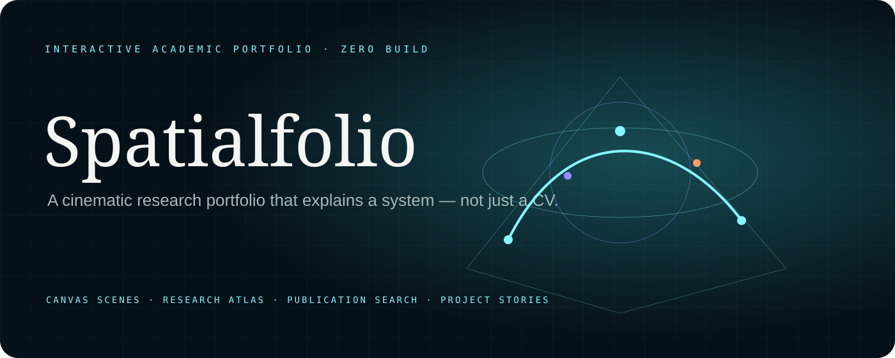
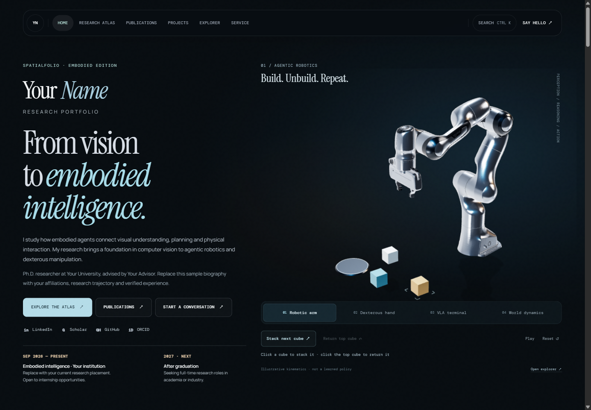
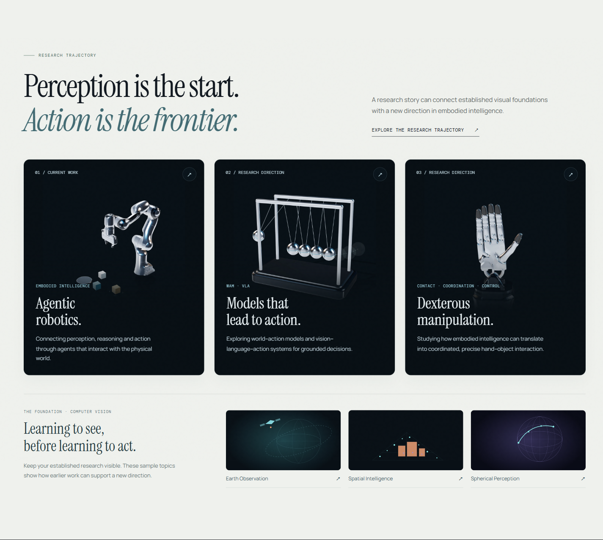
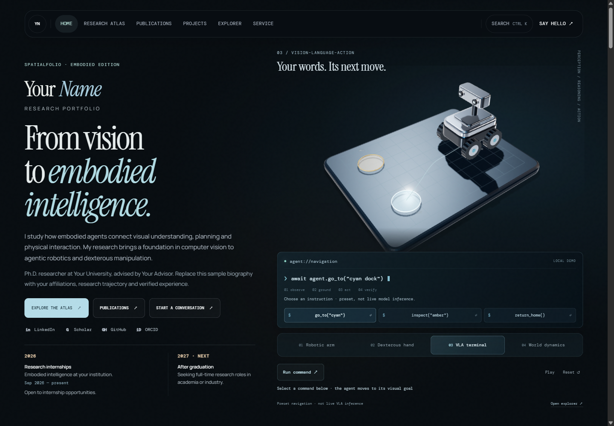

<p align="right"><a href="README.md">English</a></p>



# Spatialfolio — 交互式学术个人主页

**让研究真正动起来。** 一个面向科研工作者的电影感个人主页模板：交互式三维科研场景、精心编排的论文展示、可搜索的文献库。纯静态文件，无需构建。

<p align="center">
  <strong><a href="https://zhuqinfeng1999.github.io/">查看作者朱钦峰的个人主页 ↗</a></strong><br>
  <sub>Spatialfolio 的实际应用参考：从计算机视觉到具身智能</sub>
</p>

[定制指南](docs/CUSTOMIZE.zh-CN.md) · [用 Codex 设计动效](docs/CODEX_VISUALS.zh-CN.md) · [版本选择](docs/EDITIONS.md)

> **2.0.1 · Embodied 具身智能版。** 模板中的姓名、单位、实习起止时间与论文均为虚构示例，发布前请替换为自己的真实信息。

## 选择适合你研究方向的版本

| 版本 | 适合方向 | 场景 |
| --- | --- | --- |
| **Embodied：当前版本** | 具身智能、agentic robotics、WAM、VLA、灵巧操作 | 可逆方块堆叠、Shadow 灵巧手、VLA 风格移动机器人终端、理想化动力学实验 |
| **Perception：此前设计** | 计算机视觉、遥感、三维视觉、全景感知 | 同一城市场景下的四种关联感知视角 |

默认首页使用 Embodied 版。访问 `/editions/perception/` 可以查看此前首页；要使用完整旧版本，请选择[固定版本源码](https://github.com/zhuqinfeng1999/interactive-academic-portfolio/tree/5a9e7d3baf8532922c6961b75143788e00440742)。变更记录见 [CHANGELOG](CHANGELOG.md)。

## 效果预览





| 语言 → 动作 | 预测 → 释放 |
| --- | --- |
|  |  |

机械臂与灵巧手使用 Apache-2.0 授权的真实模型，以及 CC0 摄影棚光照；移动机器人与摆球装置为原创程序化几何。动画是**交互示意，不是模型在线推理，也不是已完成实验的结果**。硬件名称用于标识模型，不代表厂商背书。

机械臂入场自动演示一次夹取，之后可以堆叠三块方块、从顶层逐块放回。终端执行固定的导航指令，观察、目标关联、动作与验证状态和机器人同步。动力学场景演示理想化动量传递，不是真实 WAM 推理；自动动态效果尊重系统“减少动态效果”设置。

鼠标靠近方块，会显示高亮轮廓与可执行动作。摆球场景首次点击释放，运动中点击暂停，再次点击从原位置继续；**Enter** 键遵循相同逻辑，拖动仅改变观察视角。需要重新播放时，使用 **Replay impulse** 或选择另一种冲量。画布外的 **Play**、**Pause**、**Resume** 按钮提供对应的播放控制。在系统“减少动态效果”开启时，普通操作默认显示静态结果；主动点击 **Play** 才为当前场景启用动画，重置或切换场景后恢复系统偏好。

桌面首屏随视口同步调整版面、字号与场景尺寸，保持完整的大幅构图；手机端采用上下排列。年份用于机会分组，实习起止时间单独标注在对应单位下方。

## 包含什么

- 四个交互场景：选择目标、关节运动、拖动观察、触控及键盘操作。
- 清晰区分“当前工作”“未来方向”和“已发表的研究基础”。
- 论文年份／类型筛选、文本搜索及 BibTeX 复制。
- 首页完整论文记录、项目子页与研究时间线。
- 全站快捷搜索。
- Google Fonts、深浅分区、融合式论文图片。
- 减少动态效果、暂停／重置、离屏停止与静态后备图。
- 模型素材随项目提供，无需购买外部三维服务，也不依赖模型 CDN。

## 快速开始

1. 点击 **Use this template**，仓库名建议为 `yourusername.github.io`。
2. 修改各 HTML 中的身份、简介、联系信息及 SEO，再编辑 `assets/data/research.json`。
3. 添加真实论文、项目链接、简历和图片；不要把研究兴趣写成已完成成果。
4. 本地检查后，在 **Settings → Pages** 选择从默认分支、仓库根目录部署。

```bash
npm run serve
npm run validate
```

打开 `http://127.0.0.1:4173/`。无需安装依赖。模板使用根目录相对路径；如果部署到仓库名子路径，需要先统一适配 base path。

## 修改位置

| 内容 | 文件 |
| --- | --- |
| 身份、简介、求职状态、联系方式与 SEO | 从 `index.html` 开始的各 HTML |
| 研究方向、论文、项目与新闻 | `assets/data/research.json` |
| 首页精选论文编排 | `index.html` |
| 控制界面、堆叠与共享渲染器 | `assets/js/robot-stage.js` |
| 移动机器人、预设导航与理想化动力学 | `assets/js/robot-studies.js` |
| 机器人几何与关节运动 | `assets/models/` |
| 具身智能版排版 | `assets/css/embodied.css` |
| 基础设计与论文视觉处理 | `cosmic.css`、`subpages.css`、`refinement.css` |
| 旧版感知场景 | `spatial-cloud.js`、`spatial-world.js` |

机械臂先加载，灵巧手随后加载，并共用一个渲染器。压缩后的机器人网格合计约 4 MB，HDR 和后备图同样保存在本地。增加更重的素材前，请检查实际加载与 GPU 表现。

## 用 Codex 定制属于你的科研动图

具身智能版特别适合机器人研究者，但并不限制你使用其他科学主题。例如：

- **世界模型**：比较可能的未来，再执行选中的动作。
- **医学影像**：查看分割结构和不确定性，不使用患者隐私数据。
- **凝聚态物理**：交互查看晶格、自旋排列和相变参数。
- **计算机视觉**：以保留的 Perception 版为起点。

先说明科学问题，再设计交互含义。素材须有明确许可，示意图不能冒充实测结果。具体提示词与验收要求见 [Codex 指南](docs/CODEX_VISUALS.zh-CN.md)。

## 署名与许可证

请保留页脚可见的 [Built with Spatialfolio 项目链接](https://github.com/zhuqinfeng1999/interactive-academic-portfolio)。可以调整样式，但不得隐藏、移除或遮挡来源。

原创网站代码与设计采用 **Spatialfolio Non-Commercial Attribution License 1.0**，允许署名后的个人、学术、教育、科研与非营利用途；付费建站、转售、企业营销等商业使用须事先获得书面许可。完整条款见 [LICENSE](LICENSE)。

第三方部分保留各自许可：Three.js 为 MIT，机器人模型为 Apache-2.0，Poly Haven 光照为 CC0。详见[素材声明](assets/models/NOTICE.md)。

## GitHub About 建议

> A cinematic academic portfolio template with interactive 3D robotics, an embodied-intelligence edition, research atlas and searchable publications. Zero-build GitHub Pages.

推荐主题：`academic-website` · `academic-portfolio` · `portfolio-template` · `embodied-ai` · `robotics` · `threejs` · `github-pages` · `research-website` · `non-commercial`

作者：[朱钦峰 Qinfeng Zhu](https://zhuqinfeng1999.github.io/)。
